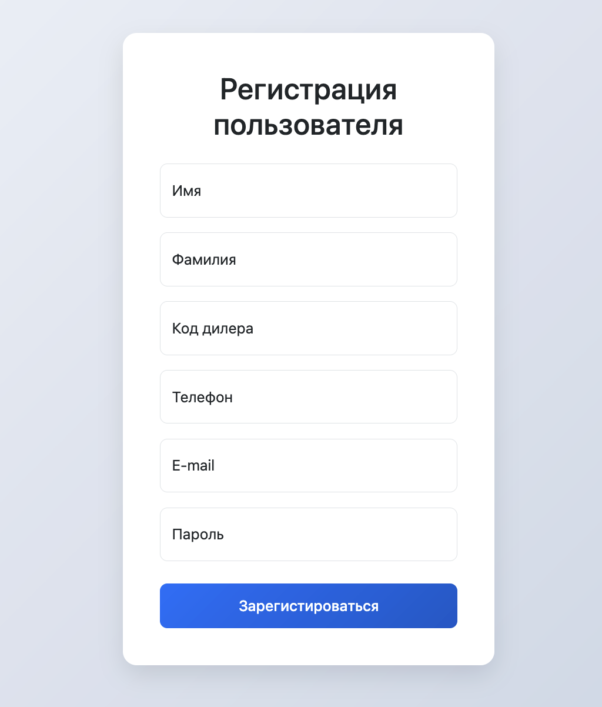
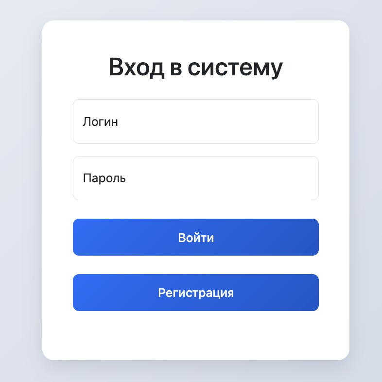
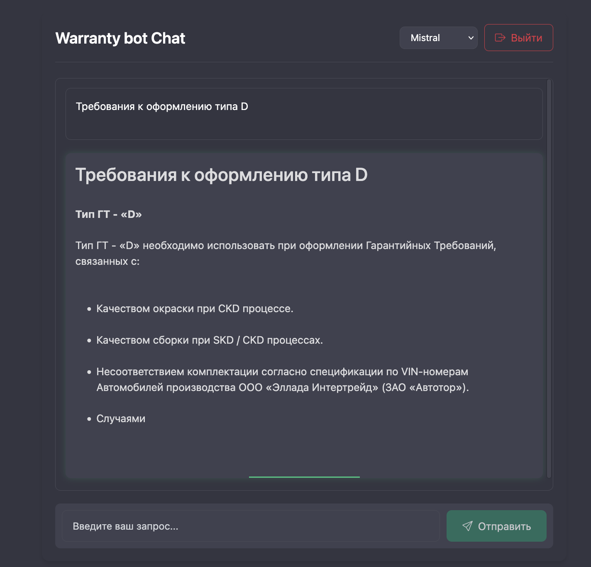
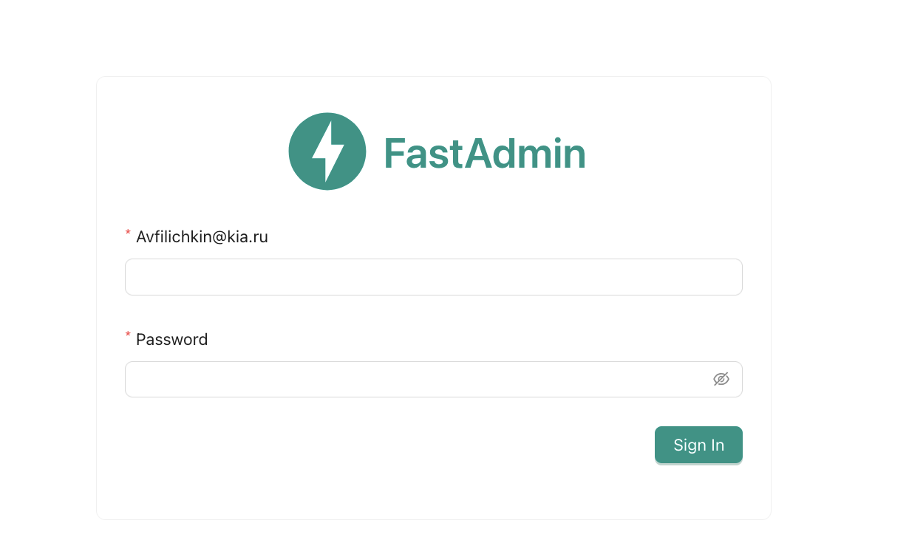

# Приложение ИИ-ассистент инженера по гарантии

## Структура проекта:

<ol>
  <li>Реализация векторной базы данных ChromaDB</li>
  <li>Реализация регистрации и авторизации</li>
  <li>Создание веб-чата с выбором нейросети DeepSeek | Mistral</li>
  <li>Интеграция через FastAPI</li>
  <li>Интеграция админ-панели с помощью fastadmin</li>
  <li>Сборка проекта в Docker compose</li>
</ol>

## Приложение






## Развертывание

Для развертывания проекта используйте Docker. Убедитесь, что у вас установлены Docker и Docker Compose. Выполните следующие команды:

```
docker compose up --build
docker compose exec app alembic revision --autogenerate -m "Initial revision"
docker compose exec app alembic upgrade head
```
После успешного выполнения этих команд приложение будет доступно по адресу:
<http://127.0.0.1:8000/auth/login/>

Админ панель будет доступна по адресу:
<http://127.0.0.1:8000/admin/>

Для создания базы данных ChromaDB воспользуйтесь скриптами из: app/database_utils


## Стек технологий


